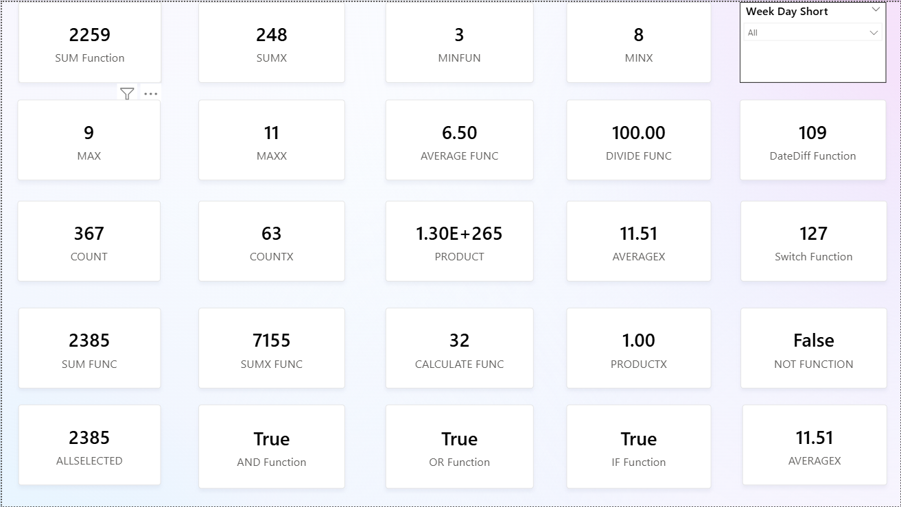
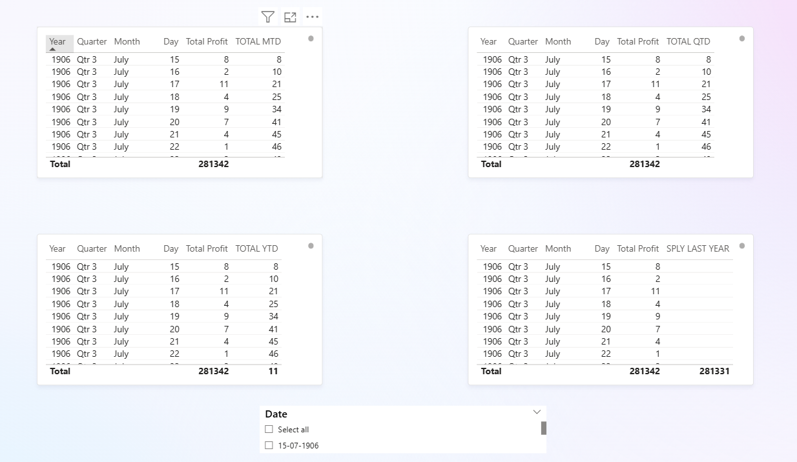
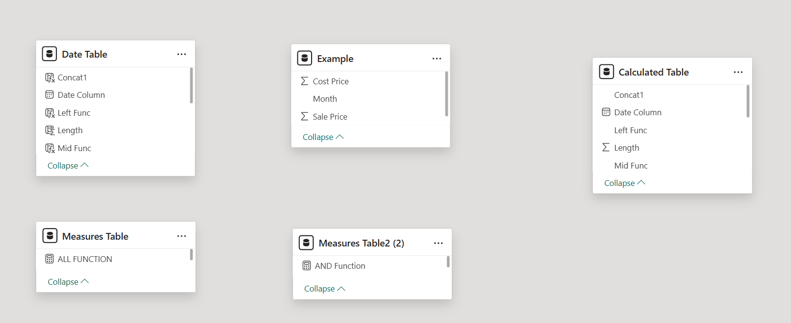

# Power BI DAX Functions & Data Model Overview

This repository contains examples of essential DAX functions used in Power BI along with the data model structure reference.  
The content is divided into **general DAX functions**, **time-intelligence DAX functions**, and **the schema (table model)** for better understanding.

---

## 📌 DAX1 — All Common DAX Functions (With One-Line Explanation)

> **Reference screenshot:**  

Below is a quick explanation of each DAX function demonstrated in DAX1:

### 🔢 Aggregation Functions
| Function | Explanation |
|----------|------------|
| `SUM(column)` | Returns the total of all numeric values in a column. |
| `AVERAGE(column)` | Calculates the arithmetic mean of numeric values. |
| `MIN(column)` | Returns the smallest value in a column. |
| `MAX(column)` | Returns the largest value in a column. |
| `COUNT(column)` | Counts non-blank values in the specified column. |
| `COUNTROWS(table)` | Counts the number of rows in a table. |
| `DISTINCTCOUNT(column)` | Counts unique values in a column. |
| `PRODUCT(column)` | Multiplies all numeric values in the column. |

### 🔁 Iterator Functions *(row-by-row evaluation before aggregation)*
| Function | Explanation |
|----------|------------|
| `SUMX(table, expression)` | Returns sum of evaluated expression for each row. |
| `AVERAGEX(table, expression)` | Returns average of calculated expression row-by-row. |
| `MINX(table, expression)` | Returns smallest evaluated expression value. |
| `MAXX(table, expression)` | Returns largest evaluated expression value. |
| `COUNTX(table, expression)` | Counts rows where expression isn't blank. |
| `PRODUCTX(table, expression)` | Multiplies evaluated values for each row. |

### 🎛 Filter & Context Control
| Function | Explanation |
|----------|------------|
| `CALCULATE(expression, filters...)` | Re-evaluates expression under modified filter context. |
| `FILTER(table, condition)` | Returns a filtered version of a table based on a condition. |
| `ALL(column/table)` | Removes filters from column/table to show full data result. |
| `ALLSELECTED(column/table)` | Clears filters except those applied using slicers. |
| `ALLEXCEPT(table, column1, ...)` | Removes all filters except the specified columns. |
| `VALUES(column)` | Returns unique values of a column as a table. |

### 🧠 Conditional / Logical
| Function | Explanation |
|----------|-------------|
| `IF(condition, true_value, false_value)` | Returns value based on condition result. |
| `SWITCH(expression, value, result, ...)` | Returns matching result based on expression comparison. |
| `AND(condition1, condition2)` | Returns TRUE only if both conditions are true. |
| `OR(condition1, condition2)` | Returns TRUE if any condition is true. |
| `NOT(condition)` | Reverses a logical condition. |
| `DIVIDE(numerator, denominator)` | Safe division that avoids divide-by-zero errors. |

---

## ⏳ DAX2 — Time Intelligence Functions (MTD, QTD, YTD, WTD Only)

> **Reference screenshot:**  

| Function | Explanation |
|----------|------------|
| `MTD(expression)` | Calculates values cumulatively from the start of the current month to today. |
| `QTD(expression)` | Calculates values cumulatively from the start of the current quarter to today. |
| `YTD(expression)` | Calculates values cumulatively from the start of the current year to today. |
| `WTD(expression)` | Calculates values cumulatively from the start of the current week to today. |

> ⮕ These functions require a **proper date table** with continuous dates for accurate results.

---

## 📊 Table Model — Schema Reference

This section displays the **relationship diagram / star schema** used in the model.

> **Reference screenshot:**  

---

## 🧾 Author

**UTKARSH KOHLI**

